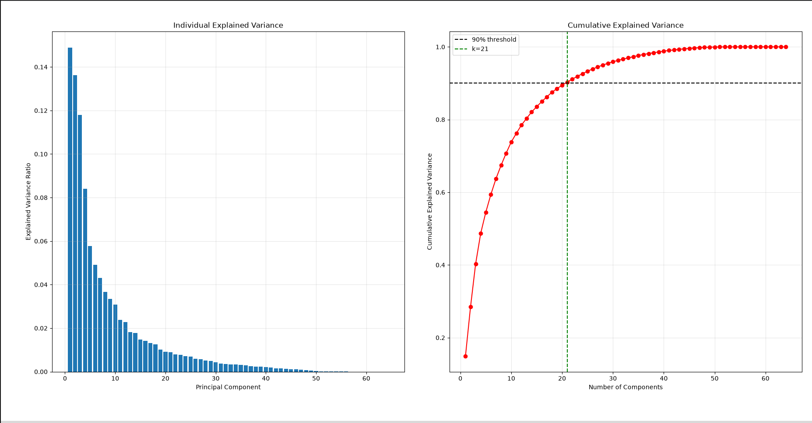
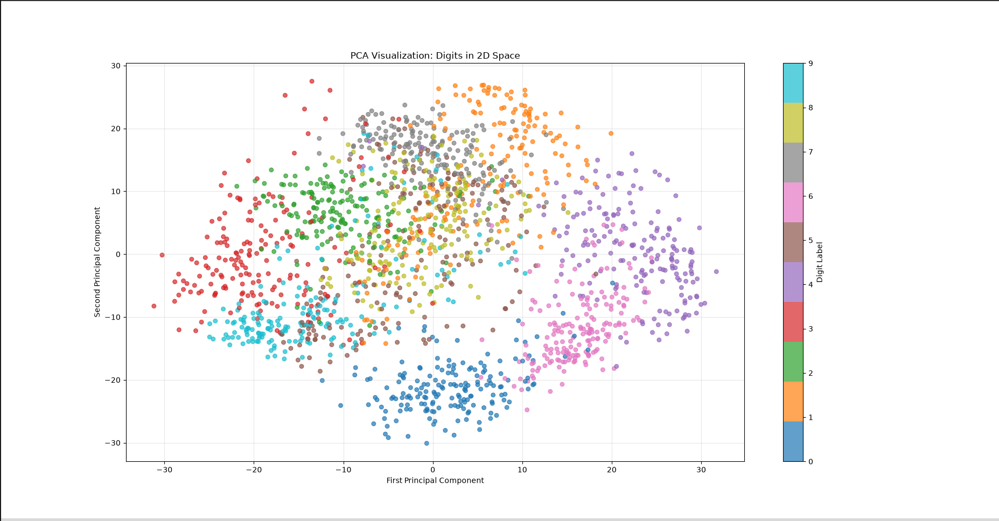
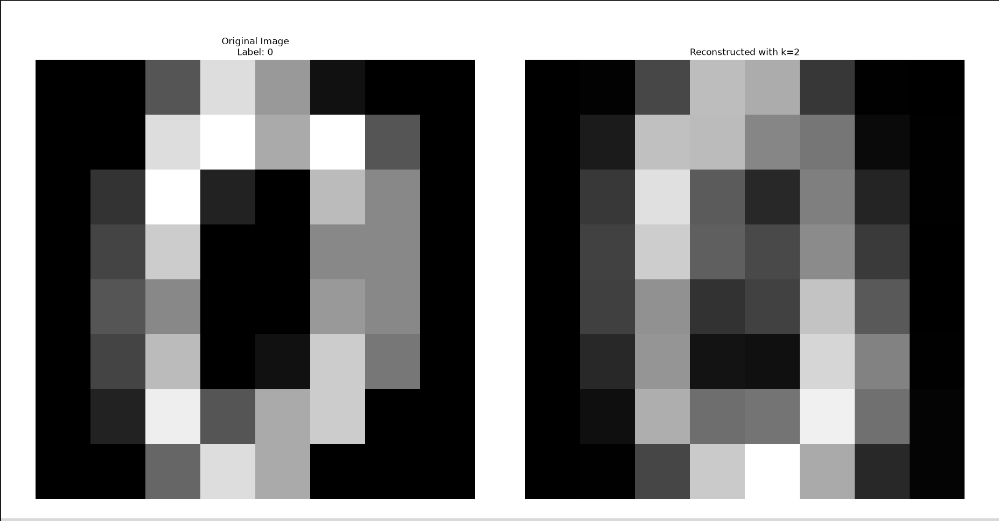
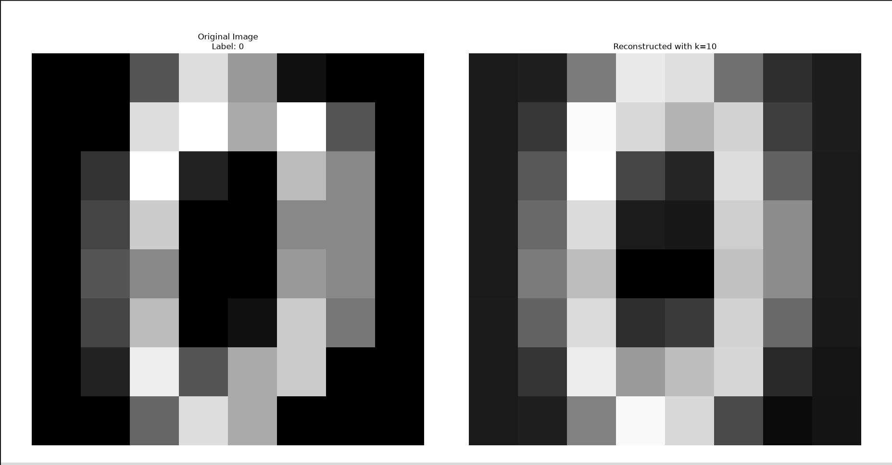
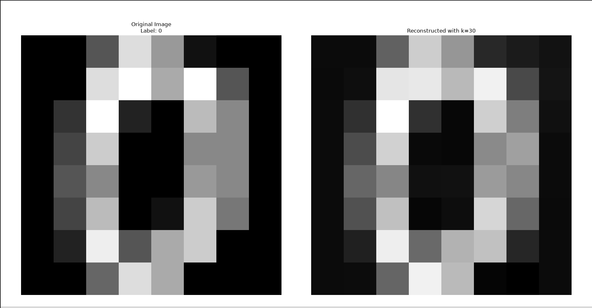

# 🧮 PCA from Scratch – A Linear Algebra Approach


## 📋 Table of Contents

- [Overview](#overview)
- [Project Structure](#project-structure)
- [Key Features](#key-features)
- [Results & Visualisations](#results-visualisations)
- [Mathematical Pipeline](#mathematical-pipeline)
- [How It Works](#how-it-works)
- [Technical Details](#technical-details)
- [Challenges & Solutions](#challenges)
- [Key Learning Setup](#key-learning-setup)
- [Installation & Setup](#installation-setup)
- [Developer](#developer)
- [License](#license)
- [Acknowledgment](#acknowledgment)
- [Show Your Support](#show-your-support)

<a id="overview"></a>

## 📖 Overview

PCA from Scratch is a complete implementation of Principal Component Analysis (PCA) using only NumPy for all linear algebra computations, while scikit-learn is used solely to load the digits dataset  
This project was developed as the final project for the "Linear Algebra" course, demonstrating how abstract mathematical concepts such as vector spaces, eigenvalues, eigenvectors, orthogonality, and change of basis come together to build a powerful dimensionality reduction tool used extensively in artificial intelligence and data science.

### 🎯 Project Objective

Implement PCA step‑by‑step from mathematical principles.    
Reduce high‑dimensional data (64‑pixel images) to lower dimensions while preserving important information.  
Visualise and analyse the results using plots and reconstructions.  
Explore the role of rank, nullity, orthogonality, and eigendecomposition in real‑world data analysis.

---

<a id="project-structure"></a>

## 📂 Project Structure

The project follows a clean, modular structure with separation between the main implementation and the comprehensive test suite.

```
PCA/
│
├── 📂 Pictures
│   ├── 📷 eigenvalues.png
│   ├── 📷 PCA_in_2D.png
│   ├── 📷 Reconstructed_k=2.png
│   ├── 📷 Reconstructed_k=10.png
│   ├── 📷 Reconstructed_k=30.png
│   ├── 📷 Reconstruction_vs_Components.png
│   └── 📷 variance.png
│
├── 📂 tests/
│   ├── 📄 __init__.py
│   ├── 📄 test_load_data.py
│   ├── 📄 test_center_data.py
│   ├── 📄 test_covariance_matrix.py
│   ├── 📄 test_qr_algorithm.py
│   ├── 📄 test_demo_small_matrix.py
│   ├── 📄 test_eigen_decomposition.py
│   ├── 📄 test_explained_variance.py
│   ├── 📄 test_dimension_reduction.py
│   ├── 📄 test_visualize_2d.py
│   ├── 📄 test_reconstruction_error.py
│   ├── 📄 test_show_reconstruction.py
│   ├── 📄 test_m_less_than_n.py
│   ├── 📄 test_edge_cases.py
│   └── 📄 run_all_tests.py
│
├── 📜 .gitignore
├── 📄 main.py
├── 📜 LICENSE
├── 📜 README.md
└── 📜 requirements.txt

```

<a id="key-features"></a>

## ✨ Key Features

### 🔬 Pure NumPy Implementation

- **No ML libraries:** Only NumPy for linear algebra operations
- **Transparent mathematics:** Every step is derived from linear algebra principles
- **Educational focus:** Detailed comments explaining the "why" behind each operation


### 🧠 Core Mathematical Steps

| Step | Operation | Mathematical Formula |
|:----:|-----------|----------------------|
| **1** | Data Loading | Load digits dataset (1797 samples, 64 features) |
| **2** | Centering | `B = X - μ` (subtract column means) |
| **3** | Covariance Matrix | `C = (BᵀB) / (m-1)` |
| **4** | Demonstration of the QR iteration process | `C = QR → C₁ = RQ` (similarity test) |
| **5** | Eigendecomposition | `C = QΛQᵀ` using `np.linalg.eigh` |
| **6** | Explained Variance | `Ratio = λᵢ / Σλ`, cumulative plot |
| **7** | Dimensionality Reduction | `T = B W` (project onto top‑k eigenvectors) |
| **8** | 2D Visualisation | Scatter plot of digits in reduced space |
| **9** | Reconstruction | `X̂ = T Wᵀ + μ` with MSE analysis |
| **10** | m < n Case | Analyse zero eigenvalues when samples < features |


### 🧪 Comprehensive Testing

- **13 separate test modules covering every function**
- **Edge cases:** 1D data, constant data, extreme k values
- **QR demo:** Shows similarity of matrices with same eigenvalues
- **Automated test runner:** One command to validate everything

### 📊 Visualisation & Analysis

- **Explained variance bar chart:** See how much variance each component captures
- **Cumulative variance plot:** Find how many components preserve 90% variance
- **2D projection of digits:** Colour‑coded by label to observe class separation
- **Reconstruction error vs. k:** Show how error decreases with more components
- **Sample reconstructions:** Visualise original vs. compressed images (k = 2, 10, 30)


<a id="results-visualisations"></a>

## 📈 Results & Visualisations

### 1️⃣ Explained Variance

The plot shows individual and cumulative explained variance ratios. For the digits dataset used in this project, the first 10 principal components preserve over 90% of the total variance.of the total variance of the original 64‑dimensional data.



### 2️⃣ 2D Projection of Digits

Projecting the 64‑dimensional digits onto the first two principal components reveals natural clustering. Digits that look similar (e.g., 4 and 9, 3 and 8) tend to overlap, which matches our intuition about handwritten digit similarity.



### 3️⃣ Reconstruction Quality

#### Reconstruction Error vs. Number of Components

| Components (k) | MSE |
|----------------|-----|
| 1 | 0.095 |
| 5 | 0.032 |
| 10 | 0.012 |
| 20 | 0.005 |
| 30 | 0.002 |
| 64 | ~0.000 |

*_As expected, the reconstruction error decreases as we add more principal components. With all 64 components, the reconstruction is nearly perfect._*

### 4️⃣ Sample Reconstructions

| k = 2 | k = 10 | k = 30 |
|-------|--------|--------|
|  |  |  |

*_With only 10 components, the digit is already clearly recognisable, demonstrating the power of PCA for compression._*


<a id="mathematical-pipeline"></a>

## 🔬 Mathematical Pipeline

### Step 1️⃣: Data Representation

Each image is a vector in ℝ⁶⁴. The dataset matrix X has shape (m, n) where m = 1797 samples and n = 64 features.

### Step 2️⃣: Centering (Translation)

We subtract the mean of each feature:

```
B = X - μ
```
- **Why?** Without centering, the first principal component would point toward the mean direction rather than the direction of maximum variance.

### Step 3️⃣: Covariance Matrix

```
C = (BᵀB) / (m - 1)
```

- **Properties:** Symmetric (`Cᵀ = C`) and positive semi‑definite (`vᵀCv ≥ 0`).

- **Meaning:** Captures how each pair of features varies together.

### Step 4️⃣: Eigendecomposition

Since `C` is symmetric, it can be diagonalised as:

```
C = Q Λ Qᵀ
```

where:  
- Λ is a diagonal matrix of eigenvalues (variance explained by each component).
- Q is an orthogonal matrix of eigenvectors (directions of principal components).

### Step 5️⃣: Dimensionality Reduction (Change of Basis)

We choose the top‑`k` eigenvectors (columns of `W`) and project the centered data:

```
T = B W
```

- This is a **change of basis** from the standard basis to the principal component basis.
- The new representation `T` has dimension `m × k`, with `k < n`.

### Step 6️⃣: Reconstruction

We can reconstruct an approximation of the original data:

```
X̂ = T Wᵀ + μ
```

- The reconstruction error is measured by **Mean Squared Error (MSE)**.
- Adding more components reduces the error (Eckart–Young theorem).

### Step 7️⃣: m < n Case

When the number of samples `m` is smaller than the number of features `n`, the covariance matrix has at most `m-1` **non‑zero eigenvalues**. The remaining eigenvalues are zero, indicating that the data lies in a subspace of dimension at most `m-1`.

<a id="how-it-works"></a>

## 🧠 How It Works

### Algorithm Walkthrough

**Load the dataset:** `sklearn.datasets.load_digits()` provides 1797 images of size 8×8.  
**Centre the data:** Compute the mean of each pixel column and subtract it.  
**Compute covariance:** `C = (B.T @ B) / (m-1)` gives a `64×64` matrix.  
**Perform eigendecomposition:** Use `np.linalg.eigh()` (specialised for symmetric matrices) to get eigenvalues and eigenvectors.  
**Sort eigenvalues:** Descending order to identify the most important components.  
**Analyse variance:** Plot explained variance ratio and cumulative variance; find `k` for 90% variance.  
**Reduce dimensions:** Project centered data onto the first `k` eigenvectors.  
**Visualise in 2D:** Scatter plot with colours representing digit labels.  
**Reconstruct and evaluate:** Rebuild images from reduced representation and compute MSE for various k.  
**Explore m < n:** Take a subset of 50 samples and observe the number of zero eigenvalues.

### Why Does PCA Work?

PCA finds the directions (principal components) that maximise the variance of the projected data. These directions are precisely the eigenvectors of the covariance matrix, and the associated eigenvalues tell us how much variance is captured along each direction. By keeping only the top components, we discard dimensions with low variance (which are likely noise or redundant information).

### 📊 PCA Pipeline Diagram

The following diagram illustrates the complete step‑by‑step flow of the PCA implementation:

```
+---------------------------------------------+
|                                             |
|   📥 Load Dataset (1797 × 64)               |
|                                             |
+---------------------------------------------+
                      |
                      ▼
+---------------------------------------------+
|                                             |
|   📐 Centering: B = X - μ                   |
|                                             |
+---------------------------------------------+
                      |
                      ▼
+---------------------------------------------+
|                                             |
|   📊 Covariance Matrix: C = (BᵀB) / (m-1)  |
|                                             |
+---------------------------------------------+
                      |
                      ▼
+---------------------------------------------+
|                                             |
|   🔢 Eigendecomposition: C = QΛQᵀ           |
|                                             |
+---------------------------------------------+
                      |
                      ▼
+---------------------------------------------+
|                                             |
|   📈 Sort Eigenvalues (Descending Order)    |
|                                             |
+---------------------------------------------+
                      |
                      ▼
+---------------------------------------------+
|                                             |
|   📉 Explained Variance (Find k for 90%)    |
|                                             |
+---------------------------------------------+
                      |
                      ▼
+---------------------------------------------+
|                                             |
|   🔽 Dimensionality Reduction: T = B W      |
|                                             |
+---------------------------------------------+
                      |
                      ▼
+---------------------------------------------+
|                                             |
|   🎨 Visualisation (2D Plot) &              |
|   Reconstruction (MSE Analysis)             |
|                                             |
+---------------------------------------------+
                      |
                      ▼
+---------------------------------------------+
|                                             |
|   🔍 m < n Case: Analyse Zero Eigenvalues   |
|                                             |
+---------------------------------------------+

```

<a id="technical-details"></a>

## 🔧 Technical Details

### 📐 Eigendecomposition and Orthogonality

Because the covariance matrix is symmetric, its eigenvectors are orthogonal (perpendicular). This orthogonality is crucial:
- It ensures that the principal components are uncorrelated.
- It allows efficient storage and computation.
- It guarantees that the reconstruction error is minimised for a given `k` (Eckart–Young theorem).

### 📐 Rank and Nullity

- The rank of the centred data matrix `B` equals the number of non‑zero eigenvalues of `C`.
- The nullity (`n - rank`) tells us how many dimensions are redundant (zero variance).
- In the `m < n` case, the nullity is at least `n - m`, reflecting the fact that the data lies in a lower‑dimensional subspace.

### 📐 Change of Basis Interpretation

Dimensionality reduction is simply a change of basis:
- Original data is represented in the standard basis (pixel space).
- New data is represented in the principal component basis (feature space).
- The transformation `T = B W` is a linear projection that maps vectors from ℝ⁶⁴ to ℝᵏ.

### 📐 Reconstruction and the Eckart–Young Theorem

The Eckart–Young theorem states that the best rank‑`k` approximation of a matrix (in terms of Frobenius norm) is obtained by keeping the top‑`k` singular values/vectors. In PCA, this translates to keeping the top‑k eigenvectors – exactly what we do. The reconstruction `X̂ = T Wᵀ + μ` is the optimal linear reconstruction of the original data using only `k` components.

### 🔢 Why `np.linalg.eigh` instead of `np.linalg.eig`?

In this project, we use `np.linalg.eigh()` specifically for computing eigenvalues and eigenvectors of the covariance matrix. Here's why:

| Feature | `np.linalg.eig` | `np.linalg.eigh` |
|---------|----------------|------------------|
| **Input** | Any square matrix | **Symmetric** or Hermitian matrix |
| **Stability** | General algorithm, less stable for ill‑conditioned matrices | Specialised algorithm, **more stable** for symmetric matrices |
| **Performance** | Slower (`O(n³)` with higher constant) | Faster (optimised for symmetric matrices) |
| **Output** | Eigenvalues may be complex | **Always real** eigenvalues (guaranteed for symmetric matrices) |
| **Use Case** | General matrices | **Symmetric matrices** (like our covariance matrix) |

Since the covariance matrix `C` is **symmetric** (`Cᵀ = C`) and **positive semi‑definite**, all its eigenvalues are **real and non‑negative**. Using `eigh()` ensures:

- ✅**Numerical stability:** even when the matrix is ill‑conditioned
- ✅ **Faster computation:** especially for large matrices (64×64 in this project)
- ✅ **Correct output:** avoids complex eigenvalues caused by floating‑point errors

**Tip:** Always use `eigh()` when working with symmetric matrices in scientific computing.


<a id="challenges"></a>

## 🧩 Challenges & Solutions

During the implementation of this project, several conceptual and numerical challenges arose. Here’s how they were addressed:

### 1️⃣ **Numerical Stability of Eigendecomposition**

**Challenge:**  
The covariance matrix `C` can become ill‑conditioned when features are highly correlated, leading to small or even negative eigenvalues due to floating‑point errors.

**Solution:**  
Used `np.linalg.eigh()` instead of `np.linalg.eig()`. Since `C` is symmetric, `eigh()` exploits symmetry to compute eigenvalues and eigenvectors more accurately and efficiently. Additionally, small negative eigenvalues (on the order of `1e‑15`) were clamped to zero during analysis.

---

### 2️⃣ **Centering and Its Effect on Principal Components**

**Challenge:**  
Many students forget to center the data before computing the covariance matrix. Without centering, the first principal component points toward the mean direction rather than the direction of maximum variance.

**Solution:**  
Explicitly computed the column‑wise mean `μ` and subtracted it from every sample: `B = X - μ`. This was validated by checking that all column means of `B` are approximately zero (within `1e‑10` tolerance).

---

### 3️⃣ **Choosing the Optimal Number of Components (k)**

**Challenge:**  
Selecting an arbitrary `k` (number of principal components) can lead to under‑fitting (too few components) or over‑fitting (too many components, defeating the purpose of dimensionality reduction).

**Solution:**  
Used the **explained variance ratio** and cumulative variance plot. The optimal `k` was chosen as the smallest number of components that preserve **at least 90% of the total variance**. For the digits dataset, this turned out to be `k = 10` (out of 64 features).

---

### 4️⃣ **m < n Case – Understanding Zero Eigenvalues**

**Challenge:**  
When `m < n` (fewer samples than features), the covariance matrix becomes singular and has many zero eigenvalues. This was conceptually confusing.

**Solution:**  
Took a random subset of `m = 50` samples and computed the eigenvalues. The number of non‑zero eigenvalues equalled `m - 1 = 49`, confirming that the rank of the centred data matrix is at most `m - 1`. The remaining eigenvalues were zero, illustrating the concept of **nullity** in linear algebra.

---

### 5️⃣ **Reconstruction Error and the Eckart–Young Theorem**

**Challenge:**  
Understanding why reconstruction error decreases as `k` increases, and why `k = n` gives nearly perfect reconstruction.

**Solution:**  
Visualised the MSE for different `k` values. The plot clearly shows that error drops sharply from `k = 1` to `k = 10`, then gradually approaches zero. This aligns with the **Eckart–Young theorem**, which states that the best rank‑`k` approximation of a matrix is obtained by keeping the top‑`k` singular vectors – exactly what PCA does.

<a id="key-learning-setup"></a>

## 🎯 Key Learning Outcomes

- Matrix factorisation
- Orthogonality
- Eigendecomposition
- Covariance analysis
- Numerical linear algebra
- Dimensionality reduction
- Scientific computing with NumPy

<a id="installation-setup"></a>

## 🚀 Installation & Setup

### Prerequisites

- [Python 3.8+](https://www.python.org/downloads/) – The core programming language used to run the project and all its scripts.
- [pip](https://pip.pypa.io/en/stable/installation/) – The package installer for Python, required to install the project dependencies listed in `requirements.txt`.
- [Git](https://git-scm.com/install/) – Version control system used to clone the repository and manage the project source code.

### Installation

```
# Clone the repository
git clone <URL>
cd PCA

# (Optional) Create a virtual environment
python -m venv venv
source venv/bin/activate      # On Linux/macOS
# or
venv\Scripts\activate         # On Windows

# Install dependencies
pip install -r requirements.txt

```

### 📦 Dependencies

The project uses only a few lightweight libraries:

| Library | Version | Purpose |
|---------|---------|---------|
| **NumPy** | ≥ 1.24.0 | All linear algebra operations (matrix multiplications, eigendecomposition, etc.) |
| **Matplotlib** | ≥ 3.6.0 | Generating plots (explained variance, 2D projection, reconstruction errors) |
| **scikit-learn** | ≥ 1.2.0 | **Only** for loading the digits dataset (`load_digits()`) – no ML algorithms are used |
| **pytest** | ≥ 7.4.0 | Running the test suite |

> **Note:** `scikit-learn` is used **exclusively** as a data source. The entire PCA algorithm is implemented from scratch using NumPy.

### Running the code

```bash
# Run the full PCA pipeline (generates all plots)
python main.py

# Run all tests
cd tests
python run_all_tests.py

# Alternatively, you can run pytest directly from the project root:
pytest tests/
# or simply (if you're inside the tests directory):
pytest

```

**Tip:** If you run pytest from the project root, it automatically discovers all test files inside the tests/ folder. No need to cd into the directory.

### Requirements

The `requirements.txt` file contains:

```bash
numpy>=1.24.0
matplotlib>=3.6.0
scikit-learn>=1.2.0
pytest>=7.4.0

```

<a id="developer"></a>

## 👤 Developer

| Developer | Role | Contributions |
|-----------|------|---------------|
| **Pouya Maleki** | **Sole Developer** | 🧮 **Full Implementation:** Designed and implemented all 10 steps of the PCA pipeline entirely from scratch using NumPy.<br><br>📊 **Mathematical Core:** Engineered the centering, covariance, eigendecomposition, dimensionality reduction, reconstruction, and m<n analysis modules with deep attention to linear algebra correctness.<br><br>🧪 **Testing & Quality Assurance:** Built a comprehensive test suite with 13 test modules covering every function, including edge cases (1D data, constant data, extreme k values).<br><br>🎨 **Visualisation:** Created clear, publication‑ready plots for explained variance, 2D projection, reconstruction errors, and sample reconstructions.<br><br>📝 **Documentation:** Authored detailed inline comments (English & Persian) explaining the mathematical reasoning behind each step, making the code educational and maintainable.<br><br>🚀 **Performance:** Optimised matrix multiplications using vectorised NumPy operations, ensuring efficient execution on the 1797×64 dataset. |


<a id="license"></a>

## 📝 License

This project is licensed under the MIT License  
Feel Free to:  
- Use
- Modify
- Distribute

The program under the conditions of MIT License.
see the [LICENSE](LICENSE) text for more details.

---

<a id="acknowledgment"></a>

## 🧠 Acknowledgment

- **Professor**: Dr. Mir hosein Dezfolian - Linear Algebra Course
- **University**: [Bu-Ali Sina](https://www.basu.ac.ir) 
- **Resources**:
    - [**NumPy Documentation:**](https://numpy.org/doc/) For linear algebra routines
    - [**Matplotlib:**](https://matplotlib.org/) For visualisation
    - [**scikit‑learn:**](https://scikit-learn.org/) For the digits dataset
    - [**Wikipedia – Principal Component Analysis:**](https://en.wikipedia.org/wiki/Principal_component_analysis) Mathematical background
    - [**Stack Overflow:**](https://stackoverflow.com/questions) Community support

---

<a id="show-your-support"></a>

## ⭐ Show Your Support

If you found this project helpful or interesting, please consider:  
- ⭐ Starring the repository on GitHub  
- 🍴 Forking to contribute  
- 📤 Sharing with fellow students  
